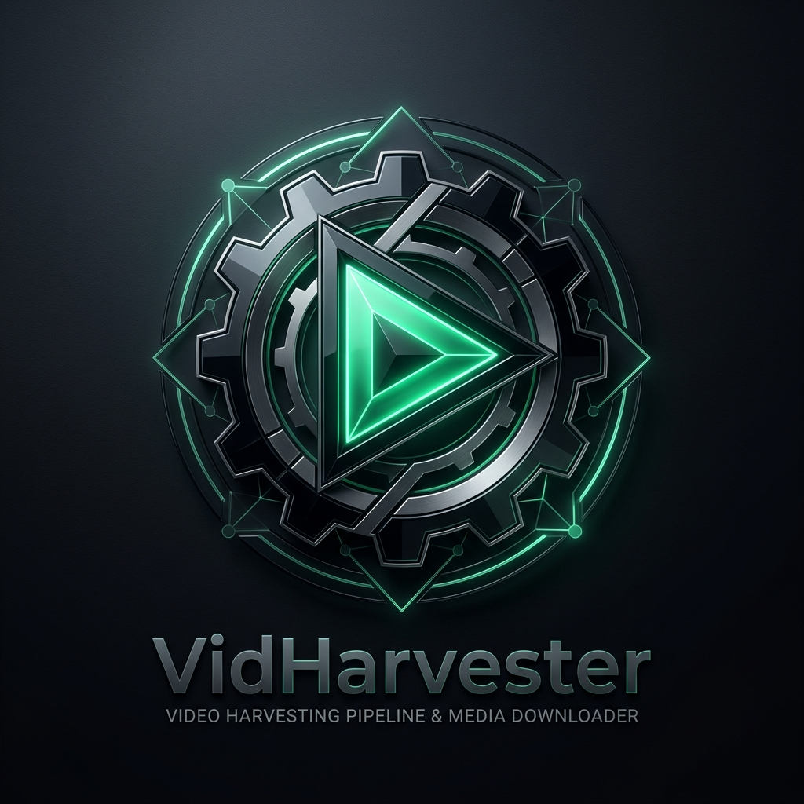

<div align="center">
  

  # VIDHARVESTER 📹
  ### Automated Video Harvesting Pipeline & Media Crawler

  [](https://www.python.org/)
  [](https://pysimplegui.readthedocs.io/)
  [](https://playwright.dev/)
  [](LICENSE)

  *Concurrent media crawler · Batch video extractor · GUI & CLI modes · Resilience logging*
</div>

---

## 📋 Overview

**VidHarvester** is an open-source video crawling and media download pipeline. Featuring both a desktop GUI and command-line execution, VidHarvester parses target media platforms, extracts high-resolution video streams, bypasses lazy-load pagination, and manages batch downloads with error recovery and progress tracking.

---

## ⚡ Quick Start & Usage

```bash
# 1. Install dependencies
pip install -r requirements.txt
playwright install chromium

# 2. Launch GUI
python3 gui.py

# OR run via CLI
python3 main.py --url "https://target-media-site.com" --out ./downloads/
```

---

## 📜 License

This project is licensed under the **MIT License**. See the [LICENSE](LICENSE) file for details.
