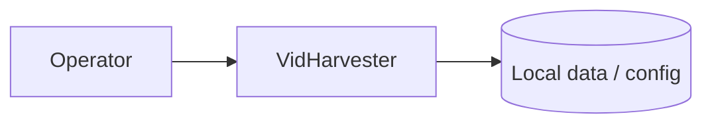

# Architecture — VidHarvester

## Stack

Detected: **python**.

## Layout

Project root: `/Volumes/A/code/VidHarvester`.

```mermaid
flowchart LR
  user[Operator] --> app[VidHarvester]
  app --> data[(Local data / config)]
```

Refine this diagram after major refactors.
